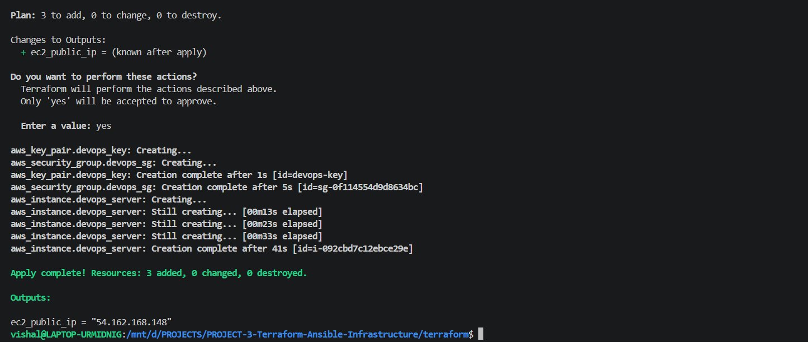
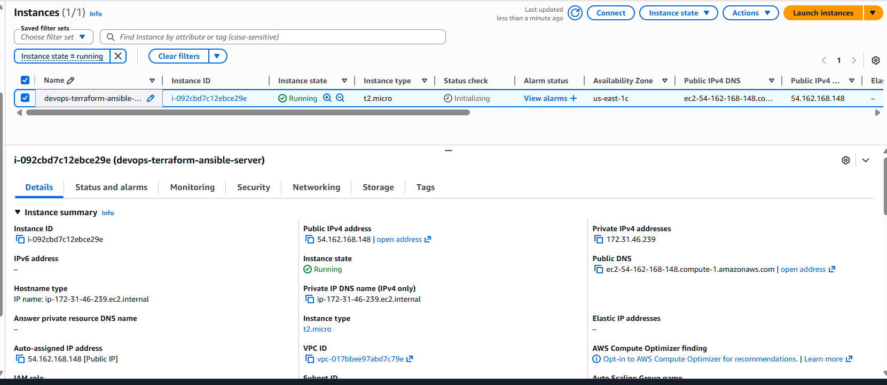
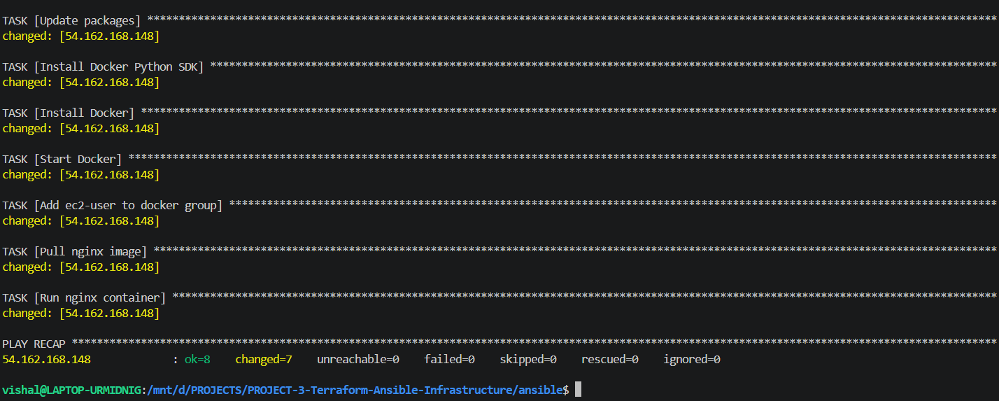
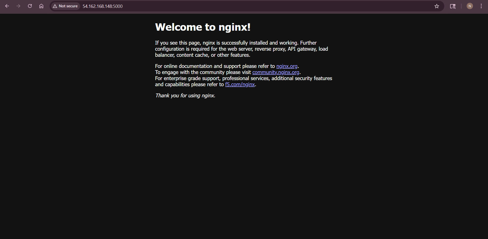

# 🚀 Automated AWS Infrastructure Provisioning using Terraform & Ansible


---

## 📌 Problem Statement

Provisioning infrastructure manually is time-consuming, error-prone, and difficult to scale.

Organizations often face:

* Inconsistent server configurations
* Manual deployment delays
* Lack of repeatability
* Increased risk of misconfiguration

---

## 💡 Solution

This project implements an **end-to-end infrastructure automation pipeline** using:

* **Terraform** to provision AWS EC2 infrastructure
* **Ansible** to configure servers and deploy applications
* **Docker** to standardize application deployment

---

## 📈 Impact

* Reduced manual infrastructure setup effort by ~70%
* Ensured consistent and repeatable server configurations
* Automated application deployment with zero manual intervention
* Improved deployment speed and reliability

---

## 🏗️ Architecture

```
Developer
   ↓
Terraform → AWS EC2 + Security Groups
   ↓
Ansible (SSH)
   ↓
Install Docker + Configure Server
   ↓
Deploy Nginx Container
   ↓
Application Available on Port 5000
```

---

## ⚙️ Tech Stack

| Category               | Tools Used |
| ---------------------- | ---------- |
| Infrastructure as Code | Terraform  |
| Configuration Mgmt     | Ansible    |
| Cloud Provider         | AWS EC2    |
| Containerization       | Docker     |
| OS                     | Linux      |

---

## 🔁 Workflow

1. Terraform provisions AWS EC2 instance and networking
2. Security groups are configured for application access
3. Ansible connects to EC2 via SSH
4. Docker is installed automatically
5. Nginx container is deployed
6. Application becomes accessible via public IP

---

## 🔁 Automation Flow 

* Infrastructure provisioning is fully automated using Terraform
* Configuration management handled using Ansible playbooks
* No manual server setup required
* End-to-end deployment completed using code

---

## 🔁 Reliability & Scalability

* Infrastructure can be recreated anytime using Terraform
* Ansible ensures consistent configuration across environments
* Easily extendable to multiple servers
* Foundation for scaling into load-balanced architecture

---

## 📂 Project Structure

```
terraform/
 ├── main.tf
 ├── variables.tf
 └── outputs.tf

ansible/
 ├── inventory
 └── install-docker.yml

README.md
```

---

## 🛠️ Setup Instructions

### 🔹 Step 1 — Provision Infrastructure

```bash
cd terraform
terraform init
terraform apply
```

---

### 🔹 Step 2 — Configure Server

```bash
cd ../ansible
ansible-playbook -i inventory install-docker.yml
```

---

## 🌐 Result

Application accessible at:

```
http://EC2_PUBLIC_IP:5000
```
---
## 📸 Screenshots

### Terraform Apply


### EC2 Instance


### Ansible Execution


### NGINX Output


---

##  Real-World Use Case

This project simulates real-world infrastructure automation where servers are provisioned and configured automatically, reducing manual intervention and improving deployment consistency.

---

## 🔮 Future Improvements

* Add Load Balancer (ALB)
* Use Auto Scaling Group
* Integrate with CI/CD pipeline
* Use Terraform modules for scalability
* Add monitoring (CloudWatch / Prometheus)

---

## 👨‍💻 Author

**Nirmalya Das**

DevOps Engineer | Cloud | Automation

---

## ⭐ Support

If you found this useful, give it a ⭐ on GitHub!
